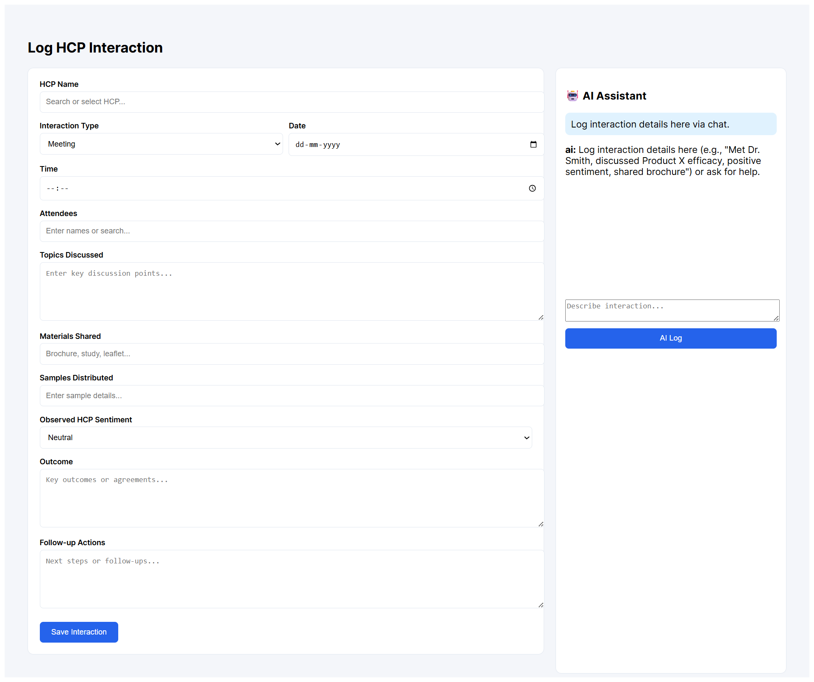

# AI CRM for Healthcare Professionals

> AI-powered CRM for healthcare field reps — describe a doctor visit in plain English, the agent handles the rest.

Field representatives log interactions with doctors using natural language. A LangGraph agent automatically extracts structured CRM data, detects sentiment, and suggests follow-up actions.

**Example:**
> "Met Dr Sharma today. Discussed Product X effectiveness. Shared brochure and samples. Doctor seemed interested."

The AI extracts structured CRM data automatically and fills the interaction form.

---

# 🏗️ Architecture

```
React Frontend
↓
FastAPI Backend
↓
LangGraph AI Agent
↓
Groq LLM (Llama-3.3-70B)
↓
PostgreSQL Database
```

---

# ⚙️ Tech Stack

**Frontend**
- React (Vite)
- Redux (state management)

**Backend**
- FastAPI
- SQLAlchemy

**AI**
- LangGraph
- Groq LLM (llama-3.3-70b-versatile)

**Database**
- PostgreSQL (Neon DB)

---

# 🤖 AI Agent Tools

The LangGraph agent includes 5 tools:

| Tool | Description |
|------|-------------|
| **Log Interaction** | Extracts structured CRM data from natural language input |
| **Edit Interaction** | Updates interaction details using natural language |
| **Analyze Sentiment** | Detects doctor engagement and sentiment |
| **Summarize Interaction** | Generates a short meeting summary |
| **Suggest Follow-up** | Recommends next actions for the field rep |

---

# ✨ Features

- AI-assisted interaction logging via natural language
- Structured CRM form with auto-fill
- Sentiment detection
- AI-generated meeting summaries
- Follow-up suggestions
- Interaction history storage
- Swagger-documented REST API

---

# 📁 Project Structure

```
AI-CRM-HCP
│
├── backend
│   ├── main.py
│   ├── agent.py
│   ├── database.py
│   ├── models.py
│   └── crm.db
│
├── frontend
│   └── crm-frontend
│       ├── src
│       ├── package.json
│       └── App.jsx
│
└── README.md
```

---

# 🚀 Running the Project

## Backend

```bash
# Navigate to backend folder
cd back-end

# Activate virtual environment
venv\Scripts\activate

# Start server
uvicorn main:app --reload
```

Backend runs at: `http://127.0.0.1:8000`  
Swagger API docs: `http://127.0.0.1:8000/docs`

## Frontend

```bash
# Navigate to frontend
cd front-end/crm-frontend

# Install dependencies
npm install

# Start development server
npm run dev
```

Frontend runs at: `http://localhost:5173`

---

# 🎬 Demo

## 📹 Demo Video
[Click here to watch the AI CRM HCP Module demo](https://drive.google.com/file/d/1poCeslJBqt0VBsw36M3r9oTen_whisZ3/view?usp=sharing)

## Screenshots

### Backend API (FastAPI Swagger)
All available CRM and AI endpoints used by the system.


### Log Interaction UI
React interface where field representatives log HCP interactions.



### AI-Powered Interaction Extraction
Natural language input automatically fills the CRM form via the AI agent.


---

# 👩‍💻 Author

**Ruqhiya Mehamoodi Begum**  
📧 [ruqhiya64@gmail.com](mailto:ruqhiya64@gmail.com)  
🎓 BE Student 
